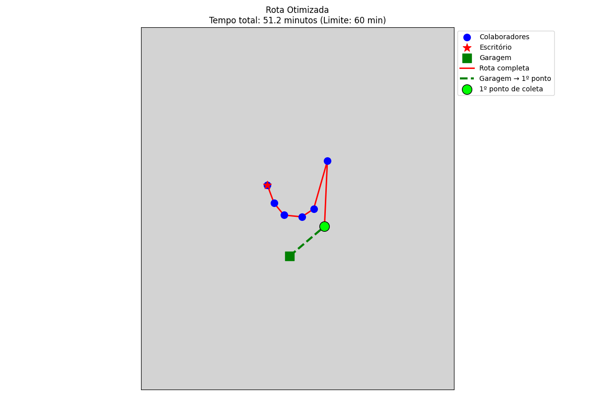

# O problema

Pessoas que vivem nas grandes metropoles hoje enfrentam um grande problema relacionado a transporte.

Muitas cidades tem uma distribuição de transporte públicos muito mal distribuídas, facilitando o transporte de pessoas que residem principalmente em regiões mais nobres e centrais das grandes cidades. Grande parte das empresas hoje oferece, por lei, o auxilio transporte para seus colaboradores, e algumas outras, alem desse beneficio também oferecem auxílio gasolina.

Grande parte dos carros possuem 4 lugares e muitas vezes, para esse transporte diario de um colaborador até o seu trabalho faz com que os outros 3 lugares sejam desnecessários e ocupem um lugar nas vias que muitas vezes poderia ser evitado, diminuindo a quantidade de veículos na rua e também e emissão de gases poluentes na atmosfera. Tendo esse problema em vista, a empresa SmartPath decidiu oferecer uma solução inteligente de transporte para empresas de até 1000 colaboradores, onde pelo menos 40% desses utilizariam o serviço.

### Exemplo:

6 colaboradores fizeram checkin para o grupo das 10h as 11h, esse horário é o horário estipulado de chegada ao escritório.

Cada grupo de transporte deve levar no máximo 1h entre o pickup do primeiro colaborador até a chegada no escritório.

O fim do horario de checkin acontece 15 minutos antes do inicio do pickup de cada grupo.

Ao termino da organização de cada grupo, o motorista recebe em seu aplicativo de GPS a rota mais otimizada do seu ponto inicial, que seria uma garagem posicionada estrategicamente em um ponto central da cidade, e o escritório ao qual esses colaboradores trabalham.

Essa solução inicialmente é uma POC, afim de testar a solução e avaliar o seu fit de mercado, posteriormente sendo implementada um algoritmo mais robusto de calculo entre as distancias.

Vamos implementar essa ideia usando algoritmo genético e inicialmente a distancia entre esses trajetos é calculada usando a formula de Haversine cuja a ideia é determinar a distancia entre dois pontos dentro de uma esfera a partir de suas latitude e longitude, sem levar em consideração fatores como semáforos, relevo ,acidentes, fatores que atrasariam o tempo de transporte entre os pontos.

A ideia inicialmente será testada na cidade de São Paulo, cuja a velocidade média dos veículos é de 22km em horário de pico, podendo chegar a 38km fora desse horário (1) Dados fornecidos pela CET-SP

Queremos saber o tempo total de locomoção entre esses pontos para uma velocidade média de 22km, e também queremos saber o tempo entre cada rota para fornecer para os colaboradores uma estimativa de tempo de quando o transporte chegara na porta de sua residência.

O primeiro grupo consiste em 6 colaboradores que estão localizados nos seguintes pontos distribuidos entre a zona sul e zona leste de Sao Paulo:

- Colaborador 1: `-23.5698758552345`, `-46.65732448678764`
- Colaborador 2: `-23.578815535284484`, `-46.64953381135834`
- Colaborador 3: `-23.5742497243436`, `-46.62602618050892`
- Colaborador 4: `-23.587337247755503`, `-46.617464808253374`
- Colaborador 5: `-23.580143702863733`, `-46.6354313345416`
- Colaborador 6: `-23.53834689887769`, `-46.61519339497031`

- O ponto de partida do veiculo é `-23.609414526900654`, `-46.64490736778047` (Garagem localizada em Mirandópolis, zona sul de São Paulo)
- O ponto final do veiculo é `-23.556466554081997`, `-46.66260117644396` (Escritorio localizado no WeWork avenida paulista)

# Como funciona:

1. Le o arquivo `coordinates` com a localização dos funcionarios que farao parte de um determinado horário de transporte. Nesse exemplo, a planilha funciona de maneira estática para representar algo que poderia ser retirado de um banco de dados contendo as informações pra X grupo. Nesse caso, vamos chamar esse grupo de grupo A (Horário 11h), para esse horário temos um total de 6 colaboradores confirmados e suas localizações de latitude e longitude

2. Calcula todas as distancias entre pontos usando a formula de Haversine

3. Retorno esperado

   1. Rota otimizada em ordem do numero de cada colaborador
   2. Distancia total do trajeto
   3. Tempo estimado de viagem levando em consideração os valores de velocidade citados no exemplo para a cidade de São Paulo

4. Retornos visuais
   1. Imagem flat simples mostrando apenas o tempo total e a ordem dos pontos

2.  Imagem em uma esfera afim de tentar chegar mais próximo do “real” já que nao temos os pontos traçados de maneira inteligente por ruas e avenidas

# Limitacoes:

- O calculo das distancias presume apenas a distancia entre dois pontos em uma esfera, sem levar em consideração as ruas entre esses dois pontos, gerando uma estimativa abaixo do tempo realista esperado, por isso, nesse POC deixamos claro essa limitação e deixamos em aberto como uma futura implementação de alguma API de mapas afim de nos fornecer distancias mais detalhadas entre esses pontos

# Propostas para uma fase dois dessa empresa

1. Utilizar APIs robustas de mapas para calcular as distancias de maneira mais detalhada
2. Integracao com o backend para fazer o envio das informações de uma rota após o calculo para uma base de dados, e com isso usar esses dados para visualização dos colaboradores ou envio de notificações com os horários estimados de cada pickup
